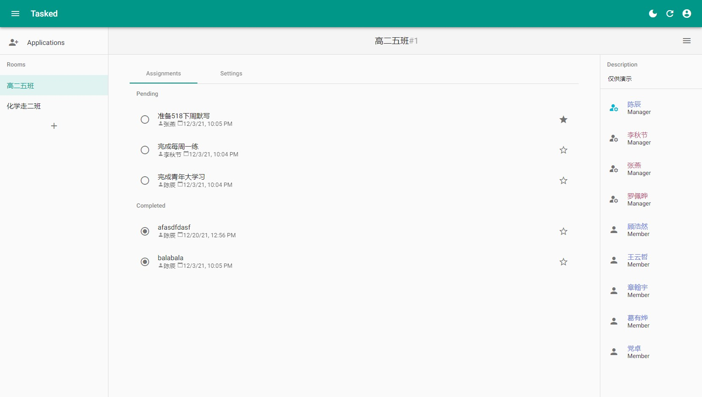
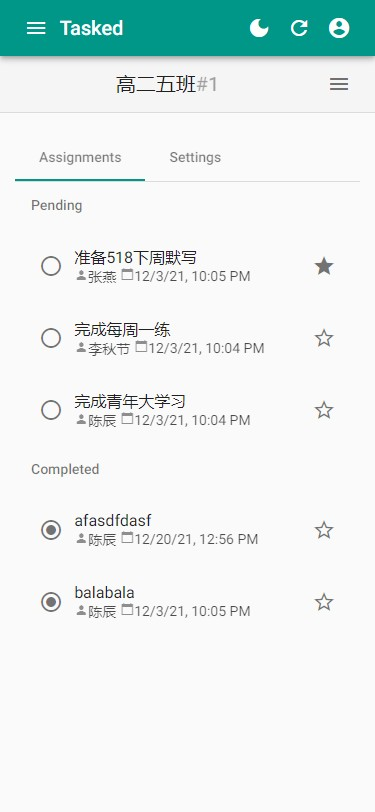
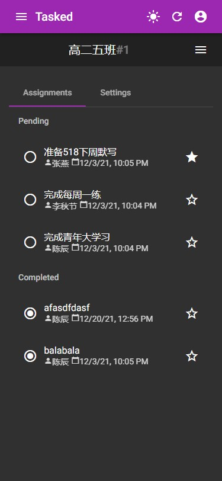
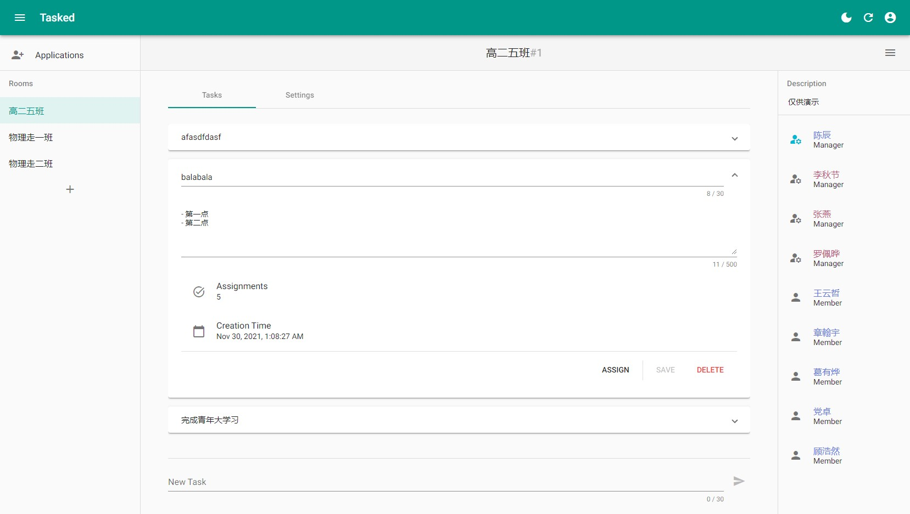
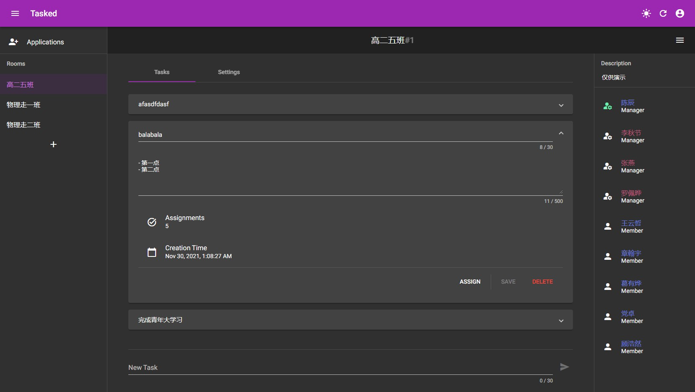
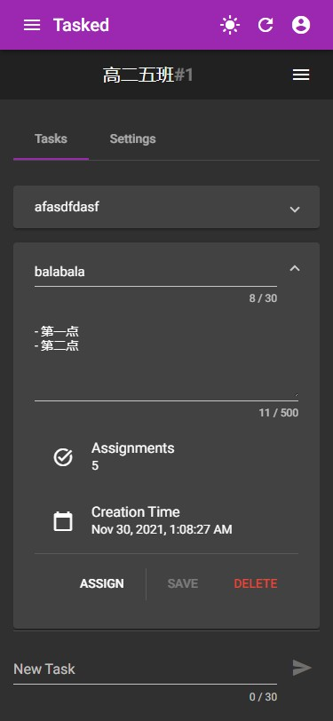

# Tasked

A todo management [PWA](https://developer.mozilla.org/en-US/docs/Web/Progressive_web_apps) implemented with Angular and Nest.

## Features

- Responsive Material UI - available for both desktops and mobiles
- Robust GraphQL API - restricted query depth, breadth, and frequency.
- Rich transitions - showed when loading
- Rooms - separate rooms for specific colleagues
- Roles - creators, managers and members have different permissions
- Lazy loading - smaller bundle size
- Multiple themes - a light one and a dark one, your preference by default
- Rich Notifications - showed after actions
- Bulk GraphQL operations - less HTTP requests
- Well-maintained state - synced locally based on mutations
- Internationalization - English and Chinese

## Main Tech Stack

- NestJS
- Angular
- TypeScript
- MikroORM
- RxJS
- GraphQL

## Screenshots

## Deployment

See child repositories.
